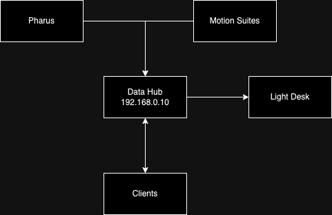

# hackinthedisco

## Overview
We have tracking input from a Software called Pharus, that gives us the 2D Position of people in space and MotionSuites with 8 gyroscope for each body.
As output we can control 20 movinghead lights and use the sound PA.

To get the tracking data, tell the data-hub your IP and you'll receive the data on port 10.000 via OSC-protocoll.
To control the moving head lights send your data to the IP 192.168.0.10 (data-hub) and tell the port you are sending on.

## Communication Diagram

## OSC namings
* light[1-20]/intensity [0-1]
* light[1-20]/color [0-1]
* light[1-20]/frost [0-1]
* light[1-20]/posx [0-19] in m
* light[1-20]/posy [0-8] in m
* light[1-20]/height [0-3] in m
